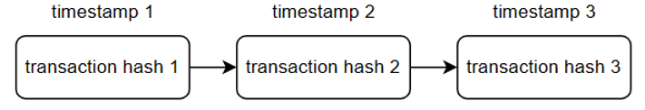

# Implementing an Attack Detection Method Based on Transaction Sequences for DApps on Ethereum
In this project, we are implementing an innovative attack detection method tailored for decentralized applications (DApps) on the Ethereum blockchain. <br>
_Note that we just classify the stage in the `kill chain` for the transaction sequences; We do not classify the specific attack used in them._

## 0. Some definitions
### a. What is transaction sequence?
The transaction sequence is a set of transactions related to an incident report, ordered by timestamp. It describes how attackers attacke DApps or how senders and receivers communicate with each other.



### b. What is the kill chain?
The kill chain represents the set of basic stages that attackers will use to target DApps. In this paper, there are four stages:

| Stage              | Definition                                               |
| :----------------- | :-------------------------------------------------------- | 
| Preparation stage  | Attackers collect vulnerabilities from targeted DApps, create/upgrade exploit contracts for attacking, and prepare funds for launching attacks |
| Exploitation stage       | Exploit vulnerabilities on targeted DApps                  |
| Propagation stage  | Exploit the same vulnerabilities on other DApps            |
| Completion stage   | Steal money from DApps or gain unauthorized access, followed by the destruction of exploit contracts |


## 1 . Environment
I ran the model on the following requirements:
- Ubuntu WSL 22.04
- Conda 23.7.4
- CUDA 12.3
- Python 3.9.18

## 2. Requirements
### a. Install Conda:
[Conda Installation Guide](https://conda.io/projects/conda/en/latest/user-guide/install/index.html)

### b. Install RDKit from Source:
- Create Conda environment:
```shell
conda create -n <env name> python=3.9
conda activate <env name>
conda install -y numpy matplotlib
conda install -y cmake cairo pillow eigen pkg-config
conda install -y boost-cpp boost swig
```

- Build `rdkit`:
```shell
git clone https://github.com/rdkit/rdkit.git
cd rdkit

mkdir build
cd build
cmake -DPy_ENABLE_SHARED=1 \
-DBOOST_ROOT="$CONDA_PREFIX" \
-DBoost_NO_SYSTEM_PATHS=ON \
-DBoost_NO_BOOST_CMAKE=TRUE \
-DRDK_INSTALL_INTREE=ON \
-DRDK_INSTALL_STATIC_LIBS=OFF \
-DRDK_BUILD_CPP_TESTS=ON \
-DRDK_BUILD_CAIRO_SUPPORT=ON \
-DRDK_BUILD_FREETYPE_SUPPORT=ON \
-DBOOST_ROOT=$CONDA_PREFIX \
-DRDK_BOOST_PYTHON3_NAME=python39 \
-DBoost_INCLUDE_DIR=$CONDA_PREFIX/include \
..

cmake --build . --config Release --target install -j 10
```

- Add to PATH:
```shell
export PATH=/path-to/rdkit:${PATH}
export RDBASE=/path-to/rdkit
export PYTHONPATH=$RDBASE
```

- Verify:
```shell
python -c "from rdkit import rdBase ; print(rdBase.rdkitVersion)"
```

### c. Install the necessary libraries
```python
pip install -r requirements.txt
```

### d. Install CUDA
Since my model relies on CUDA, so you need CUDA to be installed on your device. Alternatively, if you prefer to run the model on CPU, you will need to modify the code.

## 3. Dataset
The data files are located in the `data/` folder. Please refer to the [report](./report/report.pdf) for a detailed explanation of how I created them. Below is a description of each sub-folder in `data/`:
* `data/transaction_detail`: The CSV files contain information about each transaction related to incident reports. `attack_transaction.csv` contains all transactions associated with attacks, while `normal_transaction.csv` contains those related to non-attacks. You can view the brief in `visualize.ipynb` file. **Note: I did not use the files in this folder for training.**
<center>

| Column      | Definition                                                             |
| :---------- | :---------------------------------------------------------------------- |
| seed_event  | The address of the EOA attacker. Transactions with the same seed value indicate they are all part of the same incident report. |
| group       | The name of the targeted DApp or related DApps that exhibit similar attack behavior. |
| Other columns | Details of a transaction. You can find  on [Etherscan](https://etherscan.io/) for more information |

</center>
<br>
* `data/transaction_trace` : I used this folder for training. These files contain transaction sequences for each stage, serving as labels. The detail:

<center>

| Column         | Definition                                               |
| :-------------- | :------------------------------------------------------- |
| senders         | A list of sender addresses for each transaction in sequence |
| to_contracts    | A list of receiver addresses for each transaction in sequence issued to smart contracts; if not a smart contract, the value will be NULL |
| tx_list         | A transaction sequence                                   |
| label           | The stage of the transaction sequence, where `0` represents a non-attack stage, and the rest indicate attack stages |
| tx_count        | The number of transactions in the transaction sequence    |

</center>
<br>

* `data/transaction_trace/tx_trace.csv` : contains traces of each transaction in sequence, collected from [Bloxy](https://bloxy.info/). I utilized this data to construct graph traces.

## 4. Model
I have adapted the model functions from this [repository](https://github.com/Hanjun-Dai/pytorch_structure2vec) to tailor them for solving my specific problem. The modifications are stored in the `s2v_lib/` folder and file `graph_model.py`. The image below describes the conceptual working of the model:
<center>


</center>

**How to run:** 
```python
python graph_model.py
```
_Note that: The training time for the model is quite lengthy. It took me 2 days to train the model for binary detection, and even more time for multiclass detection._
